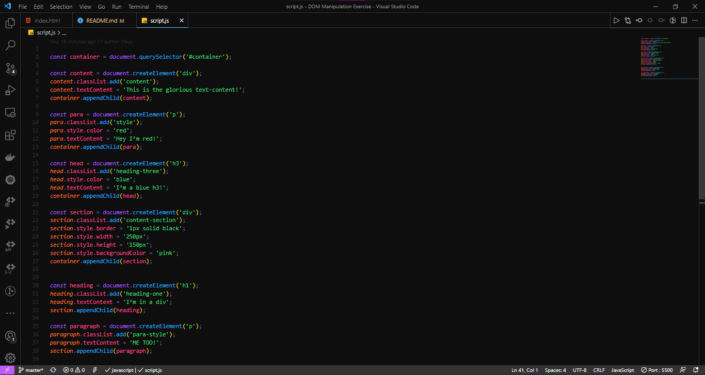

# Dom Manipulation

In this project I did a simple exercise using DOM manipulation.

## Project Screenshots

## Languages Used

- HTML
- Javascript

## License

[MIT](https://choosealicense.com/licenses/mit/)

## Project Author

Santisha Reddy

- Github: [@SantishaR](https://github.com/SantishaR)

## Acknowledgments

- [The Odin Project](https://www.theodinproject.com/paths/foundations/courses/foundations/lessons/dom-manipulation#dom---document-object-model)
